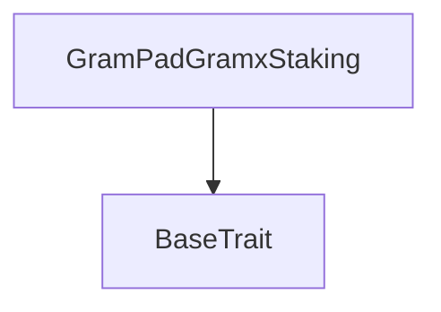
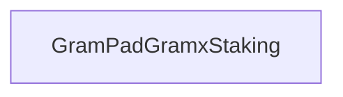

# Tact compilation report
Contract: GramPadGramxStaking
BoC Size: 12442 bytes

## Structures (Structs and Messages)
Total structures: 32

### DataSize
TL-B: `_ cells:int257 bits:int257 refs:int257 = DataSize`
Signature: `DataSize{cells:int257,bits:int257,refs:int257}`

### SignedBundle
TL-B: `_ signature:fixed_bytes64 signedData:remainder<slice> = SignedBundle`
Signature: `SignedBundle{signature:fixed_bytes64,signedData:remainder<slice>}`

### StateInit
TL-B: `_ code:^cell data:^cell = StateInit`
Signature: `StateInit{code:^cell,data:^cell}`

### Context
TL-B: `_ bounceable:bool sender:address value:int257 raw:^slice = Context`
Signature: `Context{bounceable:bool,sender:address,value:int257,raw:^slice}`

### SendParameters
TL-B: `_ mode:int257 body:Maybe ^cell code:Maybe ^cell data:Maybe ^cell value:int257 to:address bounce:bool = SendParameters`
Signature: `SendParameters{mode:int257,body:Maybe ^cell,code:Maybe ^cell,data:Maybe ^cell,value:int257,to:address,bounce:bool}`

### MessageParameters
TL-B: `_ mode:int257 body:Maybe ^cell value:int257 to:address bounce:bool = MessageParameters`
Signature: `MessageParameters{mode:int257,body:Maybe ^cell,value:int257,to:address,bounce:bool}`

### DeployParameters
TL-B: `_ mode:int257 body:Maybe ^cell value:int257 bounce:bool init:StateInit{code:^cell,data:^cell} = DeployParameters`
Signature: `DeployParameters{mode:int257,body:Maybe ^cell,value:int257,bounce:bool,init:StateInit{code:^cell,data:^cell}}`

### StdAddress
TL-B: `_ workchain:int8 address:uint256 = StdAddress`
Signature: `StdAddress{workchain:int8,address:uint256}`

### VarAddress
TL-B: `_ workchain:int32 address:^slice = VarAddress`
Signature: `VarAddress{workchain:int32,address:^slice}`

### BasechainAddress
TL-B: `_ hash:Maybe int257 = BasechainAddress`
Signature: `BasechainAddress{hash:Maybe int257}`

### Deploy
TL-B: `deploy#946a98b6 queryId:uint64 = Deploy`
Signature: `Deploy{queryId:uint64}`

### DeployOk
TL-B: `deploy_ok#aff90f57 queryId:uint64 = DeployOk`
Signature: `DeployOk{queryId:uint64}`

### FactoryDeploy
TL-B: `factory_deploy#6d0ff13b queryId:uint64 cashback:address = FactoryDeploy`
Signature: `FactoryDeploy{queryId:uint64,cashback:address}`

### ConfigureStake
TL-B: `configure_stake#dc4409af stakeKind:uint8 durationSeconds:uint32 = ConfigureStake`
Signature: `ConfigureStake{stakeKind:uint8,durationSeconds:uint32}`

### SetGramxJettonWallet
TL-B: `set_gramx_jetton_wallet#74146739 gramxJettonWallet:address = SetGramxJettonWallet`
Signature: `SetGramxJettonWallet{gramxJettonWallet:address}`

### SetAnnualRoi
TL-B: `set_annual_roi#484c524f annualRoiBasisPoints:uint16 = SetAnnualRoi`
Signature: `SetAnnualRoi{annualRoiBasisPoints:uint16}`

### SetFlexUnstakeFee
TL-B: `set_flex_unstake_fee#ff8b4afa flexUnstakeFeeBasisPoints:uint16 = SetFlexUnstakeFee`
Signature: `SetFlexUnstakeFee{flexUnstakeFeeBasisPoints:uint16}`

### SetPaused
TL-B: `set_paused#096819ff paused:bool = SetPaused`
Signature: `SetPaused{paused:bool}`

### ChangeOwner
TL-B: `change_owner#0f474d03 newOwner:address = ChangeOwner`
Signature: `ChangeOwner{newOwner:address}`

### ClaimRewards
TL-B: `claim_rewards#0d6eb785 stakeId:uint64 = ClaimRewards`
Signature: `ClaimRewards{stakeId:uint64}`

### Unstake
TL-B: `unstake#efb89d8e stakeId:uint64 = Unstake`
Signature: `Unstake{stakeId:uint64}`

### FundContractTon
TL-B: `fund_contract_ton#7007f17a  = FundContractTon`
Signature: `FundContractTon{}`

### OwnerWithdrawTon
TL-B: `owner_withdraw_ton#3140f226 amount:coins destination:address = OwnerWithdrawTon`
Signature: `OwnerWithdrawTon{amount:coins,destination:address}`

### OwnerWithdrawGramx
TL-B: `owner_withdraw_gramx#bee64f35 amount:coins destination:address = OwnerWithdrawGramx`
Signature: `OwnerWithdrawGramx{amount:coins,destination:address}`

### JettonTransferNotification
TL-B: `jetton_transfer_notification#7362d09c queryId:uint64 amount:coins sender:address forwardPayload:remainder<slice> = JettonTransferNotification`
Signature: `JettonTransferNotification{queryId:uint64,amount:coins,sender:address,forwardPayload:remainder<slice>}`

### JettonTransfer
TL-B: `jetton_transfer#0f8a7ea5 queryId:uint64 amount:coins destination:address responseDestination:address customPayload:Maybe ^cell forwardTonAmount:coins forwardPayload:remainder<slice> = JettonTransfer`
Signature: `JettonTransfer{queryId:uint64,amount:coins,destination:address,responseDestination:address,customPayload:Maybe ^cell,forwardTonAmount:coins,forwardPayload:remainder<slice>}`

### JettonExcesses
TL-B: `jetton_excesses#d53276db queryId:uint64 = JettonExcesses`
Signature: `JettonExcesses{queryId:uint64}`

### ContractDetails
TL-B: `_ owner:address deploymentId:int257 gramxJettonMaster:address gramxJettonWallet:address jettonWalletConfigured:bool annualRoiBasisPoints:int257 flexUnstakeFeeBasisPoints:int257 minStake:int257 paused:bool totalStaked:int257 rewardReserve:int257 totalRewardsPaid:int257 totalFeesCollected:int257 activeStakerCount:int257 totalStakePositions:int257 nextStakeId:int257 = ContractDetails`
Signature: `ContractDetails{owner:address,deploymentId:int257,gramxJettonMaster:address,gramxJettonWallet:address,jettonWalletConfigured:bool,annualRoiBasisPoints:int257,flexUnstakeFeeBasisPoints:int257,minStake:int257,paused:bool,totalStaked:int257,rewardReserve:int257,totalRewardsPaid:int257,totalFeesCollected:int257,activeStakerCount:int257,totalStakePositions:int257,nextStakeId:int257}`

### UserSummary
TL-B: `_ user:address totalStakePositions:int257 activeStakePositions:int257 = UserSummary`
Signature: `UserSummary{user:address,totalStakePositions:int257,activeStakePositions:int257}`

### StakeDetails
TL-B: `_ stakeId:int257 owner:address active:bool amount:int257 pendingReward:int257 roiBasisPoints:int257 stakeKind:int257 startedAt:int257 duration:int257 maturityAt:int257 claimedRewards:int257 = StakeDetails`
Signature: `StakeDetails{stakeId:int257,owner:address,active:bool,amount:int257,pendingReward:int257,roiBasisPoints:int257,stakeKind:int257,startedAt:int257,duration:int257,maturityAt:int257,claimedRewards:int257}`

### StakingDashboard
TL-B: `_ contractDetails:ContractDetails{owner:address,deploymentId:int257,gramxJettonMaster:address,gramxJettonWallet:address,jettonWalletConfigured:bool,annualRoiBasisPoints:int257,flexUnstakeFeeBasisPoints:int257,minStake:int257,paused:bool,totalStaked:int257,rewardReserve:int257,totalRewardsPaid:int257,totalFeesCollected:int257,activeStakerCount:int257,totalStakePositions:int257,nextStakeId:int257} userSummary:UserSummary{user:address,totalStakePositions:int257,activeStakePositions:int257} offset:int257 nextOffset:int257 hasMore:bool positions:dict<int, ^StakeDetails{stakeId:int257,owner:address,active:bool,amount:int257,pendingReward:int257,roiBasisPoints:int257,stakeKind:int257,startedAt:int257,duration:int257,maturityAt:int257,claimedRewards:int257}> = StakingDashboard`
Signature: `StakingDashboard{contractDetails:ContractDetails{owner:address,deploymentId:int257,gramxJettonMaster:address,gramxJettonWallet:address,jettonWalletConfigured:bool,annualRoiBasisPoints:int257,flexUnstakeFeeBasisPoints:int257,minStake:int257,paused:bool,totalStaked:int257,rewardReserve:int257,totalRewardsPaid:int257,totalFeesCollected:int257,activeStakerCount:int257,totalStakePositions:int257,nextStakeId:int257},userSummary:UserSummary{user:address,totalStakePositions:int257,activeStakePositions:int257},offset:int257,nextOffset:int257,hasMore:bool,positions:dict<int, ^StakeDetails{stakeId:int257,owner:address,active:bool,amount:int257,pendingReward:int257,roiBasisPoints:int257,stakeKind:int257,startedAt:int257,duration:int257,maturityAt:int257,claimedRewards:int257}>}`

### GramPadGramxStaking$Data
TL-B: `_ owner:address deploymentId:uint64 gramxJettonMaster:address gramxJettonWallet:address jettonWalletConfigured:bool annualRoiBasisPoints:uint16 flexUnstakeFeeBasisPoints:uint16 minStake:coins paused:bool totalStaked:coins rewardReserve:coins totalRewardsPaid:coins totalFeesCollected:coins activeStakerCount:uint32 nextTransferQueryId:uint64 nextStakeId:uint64 pendingStakeKind:dict<address, int> pendingStakeDuration:dict<address, int> userStakeCount:dict<address, int> userActiveStakeCount:dict<address, int> userStakeIdByIndex:dict<int, int> stakeOwner:dict<int, address> stakeAmount:dict<int, int> stakeRoiBasisPoints:dict<int, int> stakeKind:dict<int, int> stakeStartedAt:dict<int, int> stakeDuration:dict<int, int> stakeClaimedRewards:dict<int, int> stakeActive:dict<int, bool> = GramPadGramxStaking`
Signature: `GramPadGramxStaking{owner:address,deploymentId:uint64,gramxJettonMaster:address,gramxJettonWallet:address,jettonWalletConfigured:bool,annualRoiBasisPoints:uint16,flexUnstakeFeeBasisPoints:uint16,minStake:coins,paused:bool,totalStaked:coins,rewardReserve:coins,totalRewardsPaid:coins,totalFeesCollected:coins,activeStakerCount:uint32,nextTransferQueryId:uint64,nextStakeId:uint64,pendingStakeKind:dict<address, int>,pendingStakeDuration:dict<address, int>,userStakeCount:dict<address, int>,userActiveStakeCount:dict<address, int>,userStakeIdByIndex:dict<int, int>,stakeOwner:dict<int, address>,stakeAmount:dict<int, int>,stakeRoiBasisPoints:dict<int, int>,stakeKind:dict<int, int>,stakeStartedAt:dict<int, int>,stakeDuration:dict<int, int>,stakeClaimedRewards:dict<int, int>,stakeActive:dict<int, bool>}`

## Get methods
Total get methods: 6

## get_contract_version
No arguments

## get_contract_details
No arguments

## get_user_summary
Argument: user

## get_user_stake_id_by_index
Argument: user
Argument: index

## get_stake_details
Argument: stakeId

## get_staking_dashboard
Argument: user
Argument: offset
Argument: limit

## Exit codes
* 2: Stack underflow
* 3: Stack overflow
* 4: Integer overflow
* 5: Integer out of expected range
* 6: Invalid opcode
* 7: Type check error
* 8: Cell overflow
* 9: Cell underflow
* 10: Dictionary error
* 11: 'Unknown' error
* 12: Fatal error
* 13: Out of gas error
* 14: Virtualization error
* 32: Action list is invalid
* 33: Action list is too long
* 34: Action is invalid or not supported
* 35: Invalid source address in outbound message
* 36: Invalid destination address in outbound message
* 37: Not enough Toncoin
* 38: Not enough extra currencies
* 39: Outbound message does not fit into a cell after rewriting
* 40: Cannot process a message
* 41: Library reference is null
* 42: Library change action error
* 43: Exceeded maximum number of cells in the library or the maximum depth of the Merkle tree
* 50: Account state size exceeded limits
* 128: Null reference exception
* 129: Invalid serialization prefix
* 130: Invalid incoming message
* 131: Constraints error
* 132: Access denied
* 133: Contract stopped
* 134: Invalid argument
* 135: Code of a contract was not found
* 136: Invalid standard address
* 138: Not a basechain address
* 1173: Invalid index
* 2512: Stake not found
* 5637: No rewards available
* 6699: Stake not active
* 7529: Not enough TON for claim gas
* 8808: Reward reserve too low
* 12648: Below minimum stake
* 13325: Minimum stake required
* 15828: Locked stake not mature
* 17062: Invalid amount
* 18624: Wallet already configured
* 23376: Not enough TON for gas
* 23773: Not stake owner
* 28788: Not enough TON for unstake gas
* 28937: Not enough TON for withdraw gas
* 32101: Jetton wallet not configured
* 33750: Invalid page size
* 33848: Withdrawal exceeds TON balance
* 35499: Only owner
* 43103: Invalid withdrawal amount
* 43959: Invalid stake kind
* 45702: Invalid duration
* 46056: Nothing to unstake
* 46136: Fee too high
* 46992: Staking paused
* 48572: Invalid offset
* 49336: Exceeds withdrawable GRAMX
* 50546: Invalid Jetton wallet
* 53544: Stake not configured
* 56230: TON funding required
* 58668: Invalid ROI
* 59564: Invalid stake payload
* 61068: Stake index not found

## Trait inheritance diagram

## Contract dependency diagram

