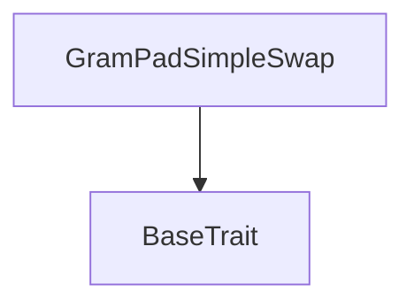
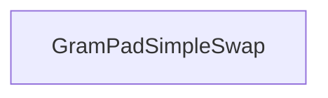

# Tact compilation report
Contract: GramPadSimpleSwap
BoC Size: 6062 bytes

## Structures (Structs and Messages)
Total structures: 29

### DataSize
TL-B: `_ cells:int257 bits:int257 refs:int257 = DataSize`
Signature: `DataSize{cells:int257,bits:int257,refs:int257}`

### SignedBundle
TL-B: `_ signature:fixed_bytes64 signedData:remainder<slice> = SignedBundle`
Signature: `SignedBundle{signature:fixed_bytes64,signedData:remainder<slice>}`

### StateInit
TL-B: `_ code:^cell data:^cell = StateInit`
Signature: `StateInit{code:^cell,data:^cell}`

### Context
TL-B: `_ bounceable:bool sender:address value:int257 raw:^slice = Context`
Signature: `Context{bounceable:bool,sender:address,value:int257,raw:^slice}`

### SendParameters
TL-B: `_ mode:int257 body:Maybe ^cell code:Maybe ^cell data:Maybe ^cell value:int257 to:address bounce:bool = SendParameters`
Signature: `SendParameters{mode:int257,body:Maybe ^cell,code:Maybe ^cell,data:Maybe ^cell,value:int257,to:address,bounce:bool}`

### MessageParameters
TL-B: `_ mode:int257 body:Maybe ^cell value:int257 to:address bounce:bool = MessageParameters`
Signature: `MessageParameters{mode:int257,body:Maybe ^cell,value:int257,to:address,bounce:bool}`

### DeployParameters
TL-B: `_ mode:int257 body:Maybe ^cell value:int257 bounce:bool init:StateInit{code:^cell,data:^cell} = DeployParameters`
Signature: `DeployParameters{mode:int257,body:Maybe ^cell,value:int257,bounce:bool,init:StateInit{code:^cell,data:^cell}}`

### StdAddress
TL-B: `_ workchain:int8 address:uint256 = StdAddress`
Signature: `StdAddress{workchain:int8,address:uint256}`

### VarAddress
TL-B: `_ workchain:int32 address:^slice = VarAddress`
Signature: `VarAddress{workchain:int32,address:^slice}`

### BasechainAddress
TL-B: `_ hash:Maybe int257 = BasechainAddress`
Signature: `BasechainAddress{hash:Maybe int257}`

### Deploy
TL-B: `deploy#946a98b6 queryId:uint64 = Deploy`
Signature: `Deploy{queryId:uint64}`

### DeployOk
TL-B: `deploy_ok#aff90f57 queryId:uint64 = DeployOk`
Signature: `DeployOk{queryId:uint64}`

### FactoryDeploy
TL-B: `factory_deploy#6d0ff13b queryId:uint64 cashback:address = FactoryDeploy`
Signature: `FactoryDeploy{queryId:uint64,cashback:address}`

### SetPaused
TL-B: `set_paused#096819ff paused:bool = SetPaused`
Signature: `SetPaused{paused:bool}`

### SetRate
TL-B: `set_rate#cca6cd3f rateScaled:uint128 = SetRate`
Signature: `SetRate{rateScaled:uint128}`

### SetTonRate
TL-B: `set_ton_rate#827678fd tonRateScaled:uint128 = SetTonRate`
Signature: `SetTonRate{tonRateScaled:uint128}`

### SetMaxBuy
TL-B: `set_max_buy#3e2cf0d9 maxBuy:coins = SetMaxBuy`
Signature: `SetMaxBuy{maxBuy:coins}`

### SetJettonWallets
TL-B: `set_jetton_wallets#273cef85 gramJettonWallet:address usdtJettonWallet:address = SetJettonWallets`
Signature: `SetJettonWallets{gramJettonWallet:address,usdtJettonWallet:address}`

### ChangeOwner
TL-B: `change_owner#0f474d03 newOwner:address = ChangeOwner`
Signature: `ChangeOwner{newOwner:address}`

### FundTon
TL-B: `fund_ton#2805d435  = FundTon`
Signature: `FundTon{}`

### OwnerWithdrawTon
TL-B: `owner_withdraw_ton#3140f226 amount:coins destination:address = OwnerWithdrawTon`
Signature: `OwnerWithdrawTon{amount:coins,destination:address}`

### OwnerWithdrawGram
TL-B: `owner_withdraw_gram#84db6bb5 amount:coins destination:address = OwnerWithdrawGram`
Signature: `OwnerWithdrawGram{amount:coins,destination:address}`

### OwnerWithdrawUsdt
TL-B: `owner_withdraw_usdt#2ceb6dc6 amount:coins destination:address = OwnerWithdrawUsdt`
Signature: `OwnerWithdrawUsdt{amount:coins,destination:address}`

### SwapTonForGram
TL-B: `swap_ton_for_gram#90f41656 minOut:coins = SwapTonForGram`
Signature: `SwapTonForGram{minOut:coins}`

### JettonTransferNotification
TL-B: `jetton_transfer_notification#7362d09c queryId:uint64 amount:coins sender:address forwardPayload:remainder<slice> = JettonTransferNotification`
Signature: `JettonTransferNotification{queryId:uint64,amount:coins,sender:address,forwardPayload:remainder<slice>}`

### JettonTransfer
TL-B: `jetton_transfer#0f8a7ea5 queryId:uint64 amount:coins destination:address responseDestination:address customPayload:Maybe ^cell forwardTonAmount:coins forwardPayload:remainder<slice> = JettonTransfer`
Signature: `JettonTransfer{queryId:uint64,amount:coins,destination:address,responseDestination:address,customPayload:Maybe ^cell,forwardTonAmount:coins,forwardPayload:remainder<slice>}`

### JettonExcesses
TL-B: `jetton_excesses#d53276db queryId:uint64 = JettonExcesses`
Signature: `JettonExcesses{queryId:uint64}`

### ContractDetails
TL-B: `_ owner:address deploymentId:int257 gramJettonMaster:address gramJettonWallet:address gramDecimals:int257 usdtJettonMaster:address usdtJettonWallet:address usdtDecimals:int257 jettonWalletsConfigured:bool paused:bool rateScaled:int257 tonRateScaled:int257 rateScale:int257 maxBuy:int257 gramReserve:int257 usdtReserve:int257 tonReserve:int257 totalSwapCount:int257 totalGramToUsdtVolume:int257 totalUsdtToGramVolume:int257 totalTonToGramVolume:int257 totalGramToTonVolume:int257 = ContractDetails`
Signature: `ContractDetails{owner:address,deploymentId:int257,gramJettonMaster:address,gramJettonWallet:address,gramDecimals:int257,usdtJettonMaster:address,usdtJettonWallet:address,usdtDecimals:int257,jettonWalletsConfigured:bool,paused:bool,rateScaled:int257,tonRateScaled:int257,rateScale:int257,maxBuy:int257,gramReserve:int257,usdtReserve:int257,tonReserve:int257,totalSwapCount:int257,totalGramToUsdtVolume:int257,totalUsdtToGramVolume:int257,totalTonToGramVolume:int257,totalGramToTonVolume:int257}`

### GramPadSimpleSwap$Data
TL-B: `_ owner:address deploymentId:uint64 gramJettonMaster:address gramJettonWallet:address gramDecimals:uint8 usdtJettonMaster:address usdtJettonWallet:address usdtDecimals:uint8 jettonWalletsConfigured:bool paused:bool rateScaled:uint128 tonRateScaled:uint128 maxBuy:coins nextTransferQueryId:uint64 gramReserve:coins usdtReserve:coins tonReserve:coins totalSwapCount:uint64 totalGramToUsdtVolume:coins totalUsdtToGramVolume:coins totalTonToGramVolume:coins totalGramToTonVolume:coins = GramPadSimpleSwap`
Signature: `GramPadSimpleSwap{owner:address,deploymentId:uint64,gramJettonMaster:address,gramJettonWallet:address,gramDecimals:uint8,usdtJettonMaster:address,usdtJettonWallet:address,usdtDecimals:uint8,jettonWalletsConfigured:bool,paused:bool,rateScaled:uint128,tonRateScaled:uint128,maxBuy:coins,nextTransferQueryId:uint64,gramReserve:coins,usdtReserve:coins,tonReserve:coins,totalSwapCount:uint64,totalGramToUsdtVolume:coins,totalUsdtToGramVolume:coins,totalTonToGramVolume:coins,totalGramToTonVolume:coins}`

## Get methods
Total get methods: 6

## get_contract_version
No arguments

## get_contract_details
No arguments

## get_quote_gram_out
Argument: usdtAmount

## get_quote_usdt_out
Argument: gramAmount

## get_quote_gram_out_from_ton
Argument: tonAmount

## get_quote_ton_out
Argument: gramAmount

## Exit codes
* 2: Stack underflow
* 3: Stack overflow
* 4: Integer overflow
* 5: Integer out of expected range
* 6: Invalid opcode
* 7: Type check error
* 8: Cell overflow
* 9: Cell underflow
* 10: Dictionary error
* 11: 'Unknown' error
* 12: Fatal error
* 13: Out of gas error
* 14: Virtualization error
* 32: Action list is invalid
* 33: Action list is too long
* 34: Action is invalid or not supported
* 35: Invalid source address in outbound message
* 36: Invalid destination address in outbound message
* 37: Not enough Toncoin
* 38: Not enough extra currencies
* 39: Outbound message does not fit into a cell after rewriting
* 40: Cannot process a message
* 41: Library reference is null
* 42: Library change action error
* 43: Exceeded maximum number of cells in the library or the maximum depth of the Merkle tree
* 50: Account state size exceeded limits
* 128: Null reference exception
* 129: Invalid serialization prefix
* 130: Invalid incoming message
* 131: Constraints error
* 132: Access denied
* 133: Contract stopped
* 134: Invalid argument
* 135: Code of a contract was not found
* 136: Invalid standard address
* 138: Not a basechain address
* 4558: TON balance too low
* 4603: TON amount required
* 5176: TON payout unavailable
* 12628: Jetton wallets not configured
* 15304: Not enough TON
* 16264: GRAM reserve too low
* 17062: Invalid amount
* 22614: Max buy exceeded
* 25347: USDT reserve too low
* 25435: TON reserve too low
* 34023: Invalid swap payload
* 34780: Invalid swap route
* 35499: Only owner
* 37466: Invalid max buy
* 38610: Invalid GRAM decimals
* 40176: Invalid rate
* 40794: Invalid TON rate
* 41529: Slippage exceeded
* 44787: Swap paused
* 50546: Invalid Jetton wallet
* 57534: Invalid USDT decimals
* 60322: Swap output too low
* 62831: Invalid min out

## Trait inheritance diagram

## Contract dependency diagram

