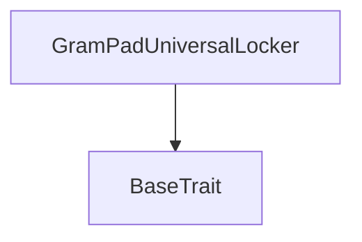

# Tact compilation report
Contract: GramPadUniversalLocker
BoC Size: 3214 bytes

## Structures (Structs and Messages)
Total structures: 24

### DataSize
TL-B: `_ cells:int257 bits:int257 refs:int257 = DataSize`
Signature: `DataSize{cells:int257,bits:int257,refs:int257}`

### SignedBundle
TL-B: `_ signature:fixed_bytes64 signedData:remainder<slice> = SignedBundle`
Signature: `SignedBundle{signature:fixed_bytes64,signedData:remainder<slice>}`

### StateInit
TL-B: `_ code:^cell data:^cell = StateInit`
Signature: `StateInit{code:^cell,data:^cell}`

### Context
TL-B: `_ bounceable:bool sender:address value:int257 raw:^slice = Context`
Signature: `Context{bounceable:bool,sender:address,value:int257,raw:^slice}`

### SendParameters
TL-B: `_ mode:int257 body:Maybe ^cell code:Maybe ^cell data:Maybe ^cell value:int257 to:address bounce:bool = SendParameters`
Signature: `SendParameters{mode:int257,body:Maybe ^cell,code:Maybe ^cell,data:Maybe ^cell,value:int257,to:address,bounce:bool}`

### MessageParameters
TL-B: `_ mode:int257 body:Maybe ^cell value:int257 to:address bounce:bool = MessageParameters`
Signature: `MessageParameters{mode:int257,body:Maybe ^cell,value:int257,to:address,bounce:bool}`

### DeployParameters
TL-B: `_ mode:int257 body:Maybe ^cell value:int257 bounce:bool init:StateInit{code:^cell,data:^cell} = DeployParameters`
Signature: `DeployParameters{mode:int257,body:Maybe ^cell,value:int257,bounce:bool,init:StateInit{code:^cell,data:^cell}}`

### StdAddress
TL-B: `_ workchain:int8 address:uint256 = StdAddress`
Signature: `StdAddress{workchain:int8,address:uint256}`

### VarAddress
TL-B: `_ workchain:int32 address:^slice = VarAddress`
Signature: `VarAddress{workchain:int32,address:^slice}`

### BasechainAddress
TL-B: `_ hash:Maybe int257 = BasechainAddress`
Signature: `BasechainAddress{hash:Maybe int257}`

### Deploy
TL-B: `deploy#946a98b6 queryId:uint64 = Deploy`
Signature: `Deploy{queryId:uint64}`

### DeployOk
TL-B: `deploy_ok#aff90f57 queryId:uint64 = DeployOk`
Signature: `DeployOk{queryId:uint64}`

### FactoryDeploy
TL-B: `factory_deploy#6d0ff13b queryId:uint64 cashback:address = FactoryDeploy`
Signature: `FactoryDeploy{queryId:uint64,cashback:address}`

### ConfigureLock
TL-B: `configure_lock#ef154798 unlockTime:uint32 = ConfigureLock`
Signature: `ConfigureLock{unlockTime:uint32}`

### SetPaused
TL-B: `set_paused#096819ff paused:bool = SetPaused`
Signature: `SetPaused{paused:bool}`

### ChangeOwner
TL-B: `change_owner#0f474d03 newOwner:address = ChangeOwner`
Signature: `ChangeOwner{newOwner:address}`

### WithdrawLock
TL-B: `withdraw_lock#6a7e172a lockId:uint64 = WithdrawLock`
Signature: `WithdrawLock{lockId:uint64}`

### EmergencyWithdrawTon
TL-B: `emergency_withdraw_ton#f1d751db amount:coins destination:address = EmergencyWithdrawTon`
Signature: `EmergencyWithdrawTon{amount:coins,destination:address}`

### JettonTransferNotification
TL-B: `jetton_transfer_notification#7362d09c queryId:uint64 amount:coins sender:address forwardPayload:remainder<slice> = JettonTransferNotification`
Signature: `JettonTransferNotification{queryId:uint64,amount:coins,sender:address,forwardPayload:remainder<slice>}`

### JettonTransfer
TL-B: `jetton_transfer#0f8a7ea5 queryId:uint64 amount:coins destination:address responseDestination:address customPayload:Maybe ^cell forwardTonAmount:coins forwardPayload:remainder<slice> = JettonTransfer`
Signature: `JettonTransfer{queryId:uint64,amount:coins,destination:address,responseDestination:address,customPayload:Maybe ^cell,forwardTonAmount:coins,forwardPayload:remainder<slice>}`

### LockDetails
TL-B: `_ lockId:int257 owner:address jettonWallet:address amount:int257 lockedAt:int257 unlockTime:int257 withdrawn:bool = LockDetails`
Signature: `LockDetails{lockId:int257,owner:address,jettonWallet:address,amount:int257,lockedAt:int257,unlockTime:int257,withdrawn:bool}`

### UserLockSummary
TL-B: `_ user:address totalLocks:int257 activeLocks:int257 = UserLockSummary`
Signature: `UserLockSummary{user:address,totalLocks:int257,activeLocks:int257}`

### ContractDetails
TL-B: `_ owner:address deploymentId:int257 paused:bool totalLockedPositions:int257 activeLockPositions:int257 totalWithdrawnPositions:int257 nextLockId:int257 = ContractDetails`
Signature: `ContractDetails{owner:address,deploymentId:int257,paused:bool,totalLockedPositions:int257,activeLockPositions:int257,totalWithdrawnPositions:int257,nextLockId:int257}`

### GramPadUniversalLocker$Data
TL-B: `_ owner:address deploymentId:uint64 paused:bool nextLockId:uint64 nextTransferQueryId:uint64 totalLockedPositions:uint64 activeLockPositions:uint64 totalWithdrawnPositions:uint64 pendingUnlockTime:dict<address, int> userLockCount:dict<address, int> userActiveLockCount:dict<address, int> userLockIdByIndex:dict<int, int> lockOwner:dict<int, address> lockJettonWallet:dict<int, address> lockAmount:dict<int, int> lockCreatedAt:dict<int, int> lockUnlockTime:dict<int, int> lockWithdrawn:dict<int, bool> = GramPadUniversalLocker`
Signature: `GramPadUniversalLocker{owner:address,deploymentId:uint64,paused:bool,nextLockId:uint64,nextTransferQueryId:uint64,totalLockedPositions:uint64,activeLockPositions:uint64,totalWithdrawnPositions:uint64,pendingUnlockTime:dict<address, int>,userLockCount:dict<address, int>,userActiveLockCount:dict<address, int>,userLockIdByIndex:dict<int, int>,lockOwner:dict<int, address>,lockJettonWallet:dict<int, address>,lockAmount:dict<int, int>,lockCreatedAt:dict<int, int>,lockUnlockTime:dict<int, int>,lockWithdrawn:dict<int, bool>}`

## Get methods
Total get methods: 5

## get_contract_version
No arguments

## get_contract_details
No arguments

## get_user_summary
Argument: user

## get_user_lock_id_by_index
Argument: user
Argument: index

## get_lock_details
Argument: lockId

## Exit codes
* 2: Stack underflow
* 3: Stack overflow
* 4: Integer overflow
* 5: Integer out of expected range
* 6: Invalid opcode
* 7: Type check error
* 8: Cell overflow
* 9: Cell underflow
* 10: Dictionary error
* 11: 'Unknown' error
* 12: Fatal error
* 13: Out of gas error
* 14: Virtualization error
* 32: Action list is invalid
* 33: Action list is too long
* 34: Action is invalid or not supported
* 35: Invalid source address in outbound message
* 36: Invalid destination address in outbound message
* 37: Not enough Toncoin
* 38: Not enough extra currencies
* 39: Outbound message does not fit into a cell after rewriting
* 40: Cannot process a message
* 41: Library reference is null
* 42: Library change action error
* 43: Exceeded maximum number of cells in the library or the maximum depth of the Merkle tree
* 50: Account state size exceeded limits
* 128: Null reference exception
* 129: Invalid serialization prefix
* 130: Invalid incoming message
* 131: Constraints error
* 132: Access denied
* 133: Contract stopped
* 134: Invalid argument
* 135: Code of a contract was not found
* 136: Invalid standard address
* 138: Not a basechain address
* 1173: Invalid index
* 9754: Lock not found
* 15304: Not enough TON
* 17062: Invalid amount
* 23764: Unlock time must be future
* 25810: Already withdrawn
* 30896: Jetton wallet not found
* 31443: Still locked
* 33848: Withdrawal exceeds TON balance
* 35499: Only owner
* 38900: Locker paused
* 40636: Nothing to withdraw
* 43062: Not lock owner
* 43103: Invalid withdrawal amount
* 49017: Lock not configured
* 63207: Lock index not found

## Trait inheritance diagram

## Contract dependency diagram

