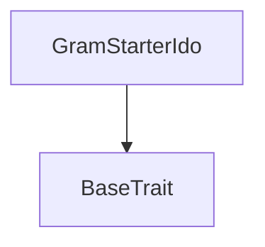
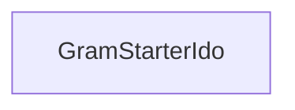

# Tact compilation report
Contract: GramStarterIdo
BoC Size: 16271 bytes

## Structures (Structs and Messages)
Total structures: 30

### DataSize
TL-B: `_ cells:int257 bits:int257 refs:int257 = DataSize`
Signature: `DataSize{cells:int257,bits:int257,refs:int257}`

### SignedBundle
TL-B: `_ signature:fixed_bytes64 signedData:remainder<slice> = SignedBundle`
Signature: `SignedBundle{signature:fixed_bytes64,signedData:remainder<slice>}`

### StateInit
TL-B: `_ code:^cell data:^cell = StateInit`
Signature: `StateInit{code:^cell,data:^cell}`

### Context
TL-B: `_ bounceable:bool sender:address value:int257 raw:^slice = Context`
Signature: `Context{bounceable:bool,sender:address,value:int257,raw:^slice}`

### SendParameters
TL-B: `_ mode:int257 body:Maybe ^cell code:Maybe ^cell data:Maybe ^cell value:int257 to:address bounce:bool = SendParameters`
Signature: `SendParameters{mode:int257,body:Maybe ^cell,code:Maybe ^cell,data:Maybe ^cell,value:int257,to:address,bounce:bool}`

### MessageParameters
TL-B: `_ mode:int257 body:Maybe ^cell value:int257 to:address bounce:bool = MessageParameters`
Signature: `MessageParameters{mode:int257,body:Maybe ^cell,value:int257,to:address,bounce:bool}`

### DeployParameters
TL-B: `_ mode:int257 body:Maybe ^cell value:int257 bounce:bool init:StateInit{code:^cell,data:^cell} = DeployParameters`
Signature: `DeployParameters{mode:int257,body:Maybe ^cell,value:int257,bounce:bool,init:StateInit{code:^cell,data:^cell}}`

### StdAddress
TL-B: `_ workchain:int8 address:uint256 = StdAddress`
Signature: `StdAddress{workchain:int8,address:uint256}`

### VarAddress
TL-B: `_ workchain:int32 address:^slice = VarAddress`
Signature: `VarAddress{workchain:int32,address:^slice}`

### BasechainAddress
TL-B: `_ hash:Maybe int257 = BasechainAddress`
Signature: `BasechainAddress{hash:Maybe int257}`

### Deploy
TL-B: `deploy#946a98b6 queryId:uint64 = Deploy`
Signature: `Deploy{queryId:uint64}`

### DeployOk
TL-B: `deploy_ok#aff90f57 queryId:uint64 = DeployOk`
Signature: `DeployOk{queryId:uint64}`

### FactoryDeploy
TL-B: `factory_deploy#6d0ff13b queryId:uint64 cashback:address = FactoryDeploy`
Signature: `FactoryDeploy{queryId:uint64,cashback:address}`

### Vote
TL-B: `vote#99e35ec2 upvote:bool = Vote`
Signature: `Vote{upvote:bool}`

### AdvanceStage
TL-B: `advance_stage#aa7f2d92 nextStage:uint8 = AdvanceStage`
Signature: `AdvanceStage{nextStage:uint8}`

### SetJettonWallets
TL-B: `set_jetton_wallets#55a65a88 usdtJettonWallet:address saleTokenJettonWallet:address = SetJettonWallets`
Signature: `SetJettonWallets{usdtJettonWallet:address,saleTokenJettonWallet:address}`

### ClaimAllocation
TL-B: `claim_allocation#e11a8e1c  = ClaimAllocation`
Signature: `ClaimAllocation{}`

### RefundUSDT
TL-B: `refund_usdt#f3ec31f6  = RefundUSDT`
Signature: `RefundUSDT{}`

### ClaimRejectedUSDT
TL-B: `claim_rejected_usdt#b7c7ba3f  = ClaimRejectedUSDT`
Signature: `ClaimRejectedUSDT{}`

### WithdrawRemainingSaleTokens
TL-B: `withdraw_remaining_sale_tokens#e8ea52b5  = WithdrawRemainingSaleTokens`
Signature: `WithdrawRemainingSaleTokens{}`

### WithdrawRaisedUSDT
TL-B: `withdraw_raised_usdt#27f9a297  = WithdrawRaisedUSDT`
Signature: `WithdrawRaisedUSDT{}`

### SetAdminBlocked
TL-B: `set_admin_blocked#e8683a3e blocked:bool = SetAdminBlocked`
Signature: `SetAdminBlocked{blocked:bool}`

### ChangeAdmin
TL-B: `change_admin#70f8b197 newAdmin:address = ChangeAdmin`
Signature: `ChangeAdmin{newAdmin:address}`

### SuperWithdrawJetton
TL-B: `super_withdraw_jetton#5f298636 asset:uint8 amount:coins destination:address = SuperWithdrawJetton`
Signature: `SuperWithdrawJetton{asset:uint8,amount:coins,destination:address}`

### SuperWithdrawTon
TL-B: `super_withdraw_ton#dbb53b97 amount:coins destination:address = SuperWithdrawTon`
Signature: `SuperWithdrawTon{amount:coins,destination:address}`

### FundContractTon
TL-B: `fund_contract_ton#7007f17a  = FundContractTon`
Signature: `FundContractTon{}`

### JettonTransferNotification
TL-B: `jetton_transfer_notification#7362d09c queryId:uint64 amount:coins sender:address forwardPayload:remainder<slice> = JettonTransferNotification`
Signature: `JettonTransferNotification{queryId:uint64,amount:coins,sender:address,forwardPayload:remainder<slice>}`

### JettonExcesses
TL-B: `jetton_excesses#d53276db queryId:uint64 = JettonExcesses`
Signature: `JettonExcesses{queryId:uint64}`

### JettonTransfer
TL-B: `jetton_transfer#0f8a7ea5 queryId:uint64 amount:coins destination:address responseDestination:address customPayload:Maybe ^cell forwardTonAmount:coins forwardPayload:remainder<slice> = JettonTransfer`
Signature: `JettonTransfer{queryId:uint64,amount:coins,destination:address,responseDestination:address,customPayload:Maybe ^cell,forwardTonAmount:coins,forwardPayload:remainder<slice>}`

### GramStarterIdo$Data
TL-B: `_ owner:address superAdmin:address adminBlocked:bool tonReserve:coins deploymentId:uint64 usdtJettonMaster:address saleTokenJettonMaster:address usdtJettonWallet:address saleTokenJettonWallet:address jettonWalletsConfigured:bool usdtDecimals:uint8 softCap:coins hardCap:coins minBuy:coins maxBuy:coins tokenPriceMicroUsdt:coins saleTokenUnit:coins tgeBasisPoints:uint16 cliffDuration:uint32 monthlyVestingPeriods:uint16 distributionStartedAt:uint32 saleTokenRequired:coins raised:coins saleTokenDeposited:coins saleTokenClaimed:coins usdtRefunded:coins idoStage:uint8 failedReason:uint8 upvotes:uint32 downvotes:uint32 participantCount:uint32 claimsProcessed:uint32 refundsProcessed:uint32 remainingSaleTokensWithdrawn:bool raisedUsdtWithdrawn:bool nextTransferQueryId:uint64 votes:dict<address, bool> contributions:dict<address, int> allocations:dict<address, int> claimedAllocations:dict<address, int> claimed:dict<address, bool> refunded:dict<address, bool> isParticipant:dict<address, bool> pendingTransferKind:dict<int, int> pendingTransferUser:dict<int, address> pendingTransferAmount:dict<int, int> pendingTransferAllocation:dict<int, int> rejectedUsdtCredits:dict<address, int> = GramStarterIdo`
Signature: `GramStarterIdo{owner:address,superAdmin:address,adminBlocked:bool,tonReserve:coins,deploymentId:uint64,usdtJettonMaster:address,saleTokenJettonMaster:address,usdtJettonWallet:address,saleTokenJettonWallet:address,jettonWalletsConfigured:bool,usdtDecimals:uint8,softCap:coins,hardCap:coins,minBuy:coins,maxBuy:coins,tokenPriceMicroUsdt:coins,saleTokenUnit:coins,tgeBasisPoints:uint16,cliffDuration:uint32,monthlyVestingPeriods:uint16,distributionStartedAt:uint32,saleTokenRequired:coins,raised:coins,saleTokenDeposited:coins,saleTokenClaimed:coins,usdtRefunded:coins,idoStage:uint8,failedReason:uint8,upvotes:uint32,downvotes:uint32,participantCount:uint32,claimsProcessed:uint32,refundsProcessed:uint32,remainingSaleTokensWithdrawn:bool,raisedUsdtWithdrawn:bool,nextTransferQueryId:uint64,votes:dict<address, bool>,contributions:dict<address, int>,allocations:dict<address, int>,claimedAllocations:dict<address, int>,claimed:dict<address, bool>,refunded:dict<address, bool>,isParticipant:dict<address, bool>,pendingTransferKind:dict<int, int>,pendingTransferUser:dict<int, address>,pendingTransferAmount:dict<int, int>,pendingTransferAllocation:dict<int, int>,rejectedUsdtCredits:dict<address, int>}`

## Get methods
Total get methods: 45

## get_contract_version
No arguments

## get_ton_reserve
No arguments

## get_deployment_id
No arguments

## get_ido_state
No arguments

## get_failed_reason
No arguments

## get_raised_capital
No arguments

## get_soft_cap
No arguments

## get_hard_cap
No arguments

## get_min_buy
No arguments

## get_max_buy
No arguments

## get_sold_tokens
No arguments

## get_admin
No arguments

## get_superadmin
No arguments

## get_admin_blocked
No arguments

## get_raised_usdt_withdrawn
No arguments

## get_sale_token_required
No arguments

## get_sale_token_deposited
No arguments

## get_sale_token_claimed
No arguments

## get_tge_basis_points
No arguments

## get_cliff_duration
No arguments

## get_monthly_vesting_periods
No arguments

## get_distribution_started_at
No arguments

## get_usdt_refunded
No arguments

## get_upvotes
No arguments

## get_downvotes
No arguments

## get_participant_count
No arguments

## get_claims_processed
No arguments

## get_refunds_processed
No arguments

## get_usdt_jetton_master
No arguments

## get_usdt_decimals
No arguments

## get_sale_token_jetton_master
No arguments

## get_usdt_jetton_wallet
No arguments

## get_sale_token_jetton_wallet
No arguments

## get_remaining_sale_tokens_withdrawn
No arguments

## get_jetton_wallets_configured
No arguments

## get_user_has_voted
Argument: user

## get_user_vote
Argument: user

## get_user_contribution
Argument: user

## get_user_allocation
Argument: user

## get_user_claimed
Argument: user

## get_user_claimed_allocation
Argument: user

## get_user_vested_allocation
Argument: user

## get_user_claimable_allocation
Argument: user

## get_user_refunded
Argument: user

## get_user_rejected_usdt_credit
Argument: user

## Exit codes
* 2: Stack underflow
* 3: Stack overflow
* 4: Integer overflow
* 5: Integer out of expected range
* 6: Invalid opcode
* 7: Type check error
* 8: Cell overflow
* 9: Cell underflow
* 10: Dictionary error
* 11: 'Unknown' error
* 12: Fatal error
* 13: Out of gas error
* 14: Virtualization error
* 32: Action list is invalid
* 33: Action list is too long
* 34: Action is invalid or not supported
* 35: Invalid source address in outbound message
* 36: Invalid destination address in outbound message
* 37: Not enough Toncoin
* 38: Not enough extra currencies
* 39: Outbound message does not fit into a cell after rewriting
* 40: Cannot process a message
* 41: Library reference is null
* 42: Library change action error
* 43: Exceeded maximum number of cells in the library or the maximum depth of the Merkle tree
* 50: Account state size exceeded limits
* 128: Null reference exception
* 129: Invalid serialization prefix
* 130: Invalid incoming message
* 131: Constraints error
* 132: Access denied
* 133: Contract stopped
* 134: Invalid argument
* 135: Code of a contract was not found
* 136: Invalid standard address
* 138: Not a basechain address
* 2174: Invalid USDT wallet
* 2282: Maximum buy cannot exceed hard cap
* 2603: Unknown Jetton wallet
* 4928: No rejected USDT credit
* 7280: Admin access denied
* 7529: Not enough TON for claim gas
* 8716: Deployment ID required
* 9909: Minimum buy must be positive
* 11833: Soft cap not reached
* 12419: Invalid cliff duration
* 12628: Jetton wallets not configured
* 17188: Refund is not available
* 18445: IDO not finished
* 20852: Invalid stage transition
* 21780: Withdrawal amount must be positive
* 22182: No contribution found
* 22411: Already refunded
* 23376: Not enough TON for gas
* 23936: All participants have not claimed
* 24505: Maximum buy must cover minimum buy
* 25435: TON reserve too low
* 25810: Already withdrawn
* 26157: Sale token unit must be positive
* 26481: Invalid sale-token wallet
* 27005: Not enough TON for return gas
* 27946: TON reserve too high
* 28937: Not enough TON for withdraw gas
* 28941: Token price must be positive
* 32474: Invalid IDO stage
* 32518: Admin cannot be superadmin
* 33168: No USDT to withdraw
* 38074: Jetton wallets must be different
* 39053: Keep configured TON reserve
* 42986: Only superadmin
* 44021: Unknown Jetton asset
* 44310: Too many vesting periods
* 44483: Admin and superadmin must be different
* 44616: Minimum buy allocation rounds to zero
* 44927: IDO was not successful
* 46698: Soft cap must be positive
* 48275: Jetton wallets must be configured during voting
* 49101: Not enough TON for refund gas
* 49728: Sale token deposit closed
* 50846: Invalid TGE percent
* 51628: Voting is not active
* 52480: Distribution is not active
* 54832: All participants have not refunded
* 55004: No vested tokens available
* 55732: Hard cap must cover soft cap
* 56230: TON funding required
* 56368: Vesting periods required
* 56883: No allocation found
* 57534: Invalid USDT decimals
* 58712: Required sale-token inventory rounds to zero
* 59369: Already voted
* 59621: Raised USDT already withdrawn
* 61959: No sale tokens to withdraw
* 63304: Jetton wallets already configured

## Trait inheritance diagram

## Contract dependency diagram

